<div align="center">

# AI Tool for Room Decoration

**Generate interior design concepts from text, then edit the furniture and décor in a real room photo, all with diffusion models.**

[](https://doi.org/10.1145/3731763.3731792)


</div>

This is the code for the paper **"AI Tool for Room Decoration: Harnessing Diffusion Model for Interior Design"**,
published at the *10th International Conference on Intelligent Information Technology* (**ICIIT 2025**, Hanoi, ACM).

Redecorating usually means imagining how a new sofa, lamp or colour scheme would look in *your* room. This tool
lets you try it on a photo instead: describe a style and get a design concept, or pick an object in your photo and
restyle it, move it, resize it, or paste in a piece of furniture from another picture, while the rest of the room
stays untouched.

## Features

The app is a [Gradio](https://www.gradio.app/) web UI with four tools:

| Tool | What you do | What you get |
|:--|:--|:--|
| **Generate Image** | Write a prompt such as *"Scandinavian living room, light wood, linen sofa"* and tune the FreeU sliders | A new interior concept from an interior-design Stable Diffusion checkpoint, sharpened with FreeU |
| **Appearance Modulation** | Upload your room and a reference photo, draw a box around the object in each | Your object takes on the reference's look (material, colour, style) and keeps its shape and place |
| **Object Moving & Resizing** | Draw a box around an object, then an arrow to where it should go | The object moves or is rescaled and the space it left is filled in naturally |
| **Object Pasting** | Upload your room and a photo of a new item, select it, set its position and size | The item is blended into your room instead of looking cut and pasted |

Every edit also reports an **SSIM score** against the original photo, so you can see how much of the room was preserved.

## Results

**Appearance modulation**: restyle the bed using a reference photo.

<table>
  <tr>
    <th>Original room</th>
    <th>Reference</th>
    <th>Result</th>
  </tr>
  <tr>
    <td>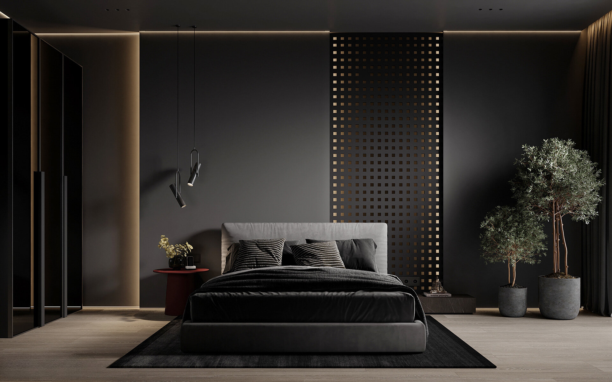</td>
    <td></td>
    <td></td>
  </tr>
</table>

**Comparison with [DragonDiffusion](https://github.com/MC-E/DragonDiffusion)**, the editing method this work builds on,
on the same inputs. On these examples our interior-focused pipeline keeps object shape and fine detail better.

<table>
  <tr>
    <th>Original</th>
    <th>DragonDiffusion</th>
    <th>Ours</th>
  </tr>
  <tr>
    <td></td>
    <td>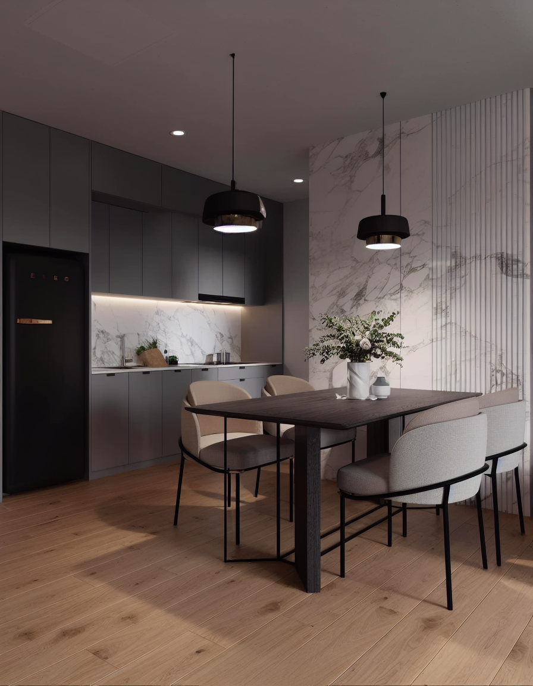</td>
    <td>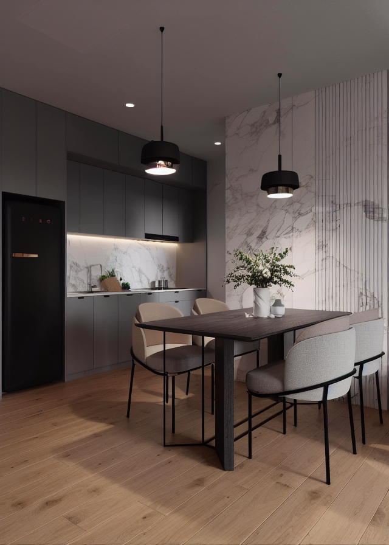</td>
  </tr>
  <tr>
    <td>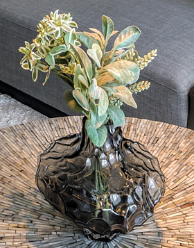</td>
    <td>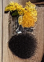</td>
    <td>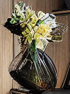</td>
  </tr>
  <tr>
    <td>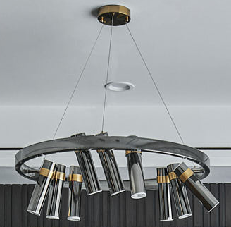</td>
    <td>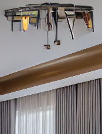</td>
    <td>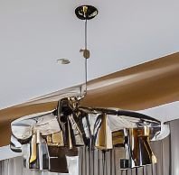</td>
  </tr>
  <tr>
    <td>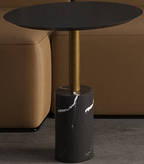</td>
    <td>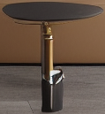</td>
    <td>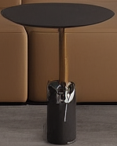</td>
  </tr>
</table>

More examples are in [`img/`](img) and [`DragonImage/`](DragonImage).

## How it works

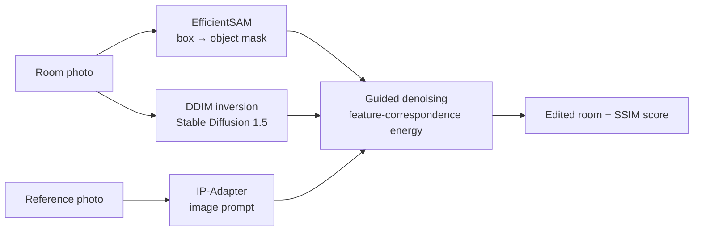

- **Editing** follows DragonDiffusion: the photo is inverted into Stable Diffusion's latent space with DDIM inversion
  (50 steps), then regenerated while an energy function built from diffusion-feature correspondence steers the chosen
  object (moving, restyling or pasting) and keeps everything else consistent with the original.
- **Object selection** uses [EfficientSAM](https://github.com/yformer/EfficientSAM): a box you draw becomes a precise mask.
- **Image prompts** come from [IP-Adapter](https://github.com/tencent-ailab/IP-Adapter), so a reference photo (not just
  text) can describe the target look. Its strength is the *Image prompt scale* slider.
- **Generation** uses the interior-design checkpoint
  [`stablediffusionapi/interiordesignsuperm`](https://huggingface.co/stablediffusionapi/interiordesignsuperm) with
  [FreeU](https://github.com/ChenyangSi/FreeU), which re-weights the UNet's backbone (b1, b2) and skip (s1, s2) features
  for more detail and contrast at no extra cost.

## Getting started

**You need:** an NVIDIA GPU with CUDA (the models run in fp16 on `cuda`) and Python 3.10.

```bash
git clone https://github.com/Ekanara/AI-Tool-for-Room-Decoration.git
cd AI-Tool-for-Room-Decoration

conda create -n roomdeco python=3.10 -y
conda activate roomdeco

# PyTorch 2.0.1 with CUDA 11.8 (on Windows, pip's default torch build is CPU-only)
pip install torch==2.0.1 torchvision==0.15.2 --index-url https://download.pytorch.org/whl/cu118
pip install -r requirements.txt transformers==4.36.2 huggingface_hub==0.25.2
```

Download the two checkpoints the app expects in `models/` (about 290 MB in total):

```bash
mkdir models
curl -L -o models/efficient_sam_vits.pt https://huggingface.co/datasets/Ekanari/AIToolForRoomDecoration/resolve/main/models/efficient_sam_vits.pt
curl -L -o models/ip_sd15_64.bin https://huggingface.co/datasets/Ekanari/AIToolForRoomDecoration/resolve/main/models/ip_sd15_64.bin
```

Start the app from the repository root:

```bash
python app.py
```

Open http://127.0.0.1:7860. Gradio also prints a temporary public `*.gradio.live` link. On first launch the Stable
Diffusion weights are downloaded from Hugging Face, which takes a while.

> **Why the extra pins?** `transformers` is imported by the code but missing from `requirements.txt`, and
> `diffusers==0.18.0` imports `cached_download`, which `huggingface_hub` removed in version 0.26.

## Project structure

```text
app.py                      Gradio app: builds the four tabs
style_generate.py           Text-to-image generation with FreeU
src/
  demo/                     UI layout (demo.py), editing entry points (model.py), mask + point helpers (utils.py)
  models/InteriorPipeline.py  Editing pipeline: SD 1.5 + IP-Adapter + DDIM inversion (adapted from DragonDiffusion)
  models/Sampler.py         Energy-guided sampler
  unet/                     UNet and attention processors with feature hooks
  freeU/                    FreeU re-weighting of UNet blocks
  utils/                    DDIM inversion and image helpers
sam/efficient_sam/          EfficientSAM model for box-to-mask segmentation
img/, DragonImage/          Evaluation and comparison images
test.py                     CLIP-score evaluation of generation with vs. without FreeU over 135 interior style prompts
```

## Citation

If this work is useful to you, please cite:

```bibtex
@inproceedings{vu2025roomdecoration,
  title     = {AI Tool for Room Decoration: Harnessing Diffusion Model for Interior Design},
  author    = {Vu, Khoi Anh and Ngo, Khoa Quoc Anh and Tran, Anh Huy and Nguyen, Phuc Le Hoang and Nguyen, Duong Huu and Tran, Bao Dinh Gia},
  booktitle = {Proceedings of the 2025 10th International Conference on Intelligent Information Technology},
  series    = {ICIIT 2025},
  location  = {Hanoi, Vietnam},
  pages     = {87--91},
  year      = {2025},
  publisher = {ACM},
  doi       = {10.1145/3731763.3731792}
}
```

## Acknowledgements

This project builds on [DragonDiffusion](https://github.com/MC-E/DragonDiffusion) (the editing pipeline is adapted from
its code), [IP-Adapter](https://github.com/tencent-ailab/IP-Adapter), [EfficientSAM](https://github.com/yformer/EfficientSAM),
[FreeU](https://github.com/ChenyangSi/FreeU), [Stable Diffusion](https://huggingface.co/stable-diffusion-v1-5/stable-diffusion-v1-5)
and [🤗 Diffusers](https://github.com/huggingface/diffusers). Many thanks to their authors.
